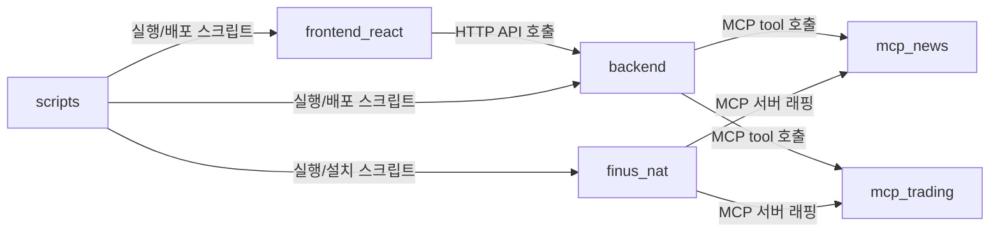

# 프로젝트 구조 및 아키텍처

### 📝 아키텍처 요약
이 프로젝트는 **UI → Orchestrator API → MCP 데이터 공급자** 흐름과, 별도의 **NAT 멀티 에이전트 워크플로**를 함께 운용합니다.

#### 핵심 모듈 역할
- **backend/**: FastAPI 오케스트레이션 계층으로, MCP/LLM 호출을 조합해 분석 API를 제공합니다.
- **finus_nat/**: NAT 워크플로 레이어로, 라우터/브랜치 에이전트와 MCP tool 래퍼를 통해 멀티 에이전트 실행을 담당합니다.
- **frontend-react/**: React UI 계층으로, backend API를 호출해 분석 결과와 원천 데이터를 시각화합니다.
- **mcp-news/**: 뉴스/수급/리서치 데이터를 제공하는 MCP 서버입니다.
- **mcp-trading/**: 잔고 조회 및 주문 실행 등 트레이딩 기능을 제공하는 MCP 서버입니다.
- **scripts/**: 로컬/도커 실행, 의존성 설치, 환경 점검 등 운영 자동화를 담당합니다.

#### 모듈 간 상호작용
- **frontend-react → backend**: HTTP API 호출
- **backend → mcp-news**: MCP tool 호출
- **backend → mcp-trading**: MCP tool 호출
- **finus_nat → mcp-news**: MCP 서버 래핑
- **finus_nat → mcp-trading**: MCP 서버 래핑
- **scripts → backend**: 실행/배포 스크립트
- **scripts → frontend-react**: 실행/배포 스크립트
- **scripts → finus_nat**: 실행/설치 스크립트

### 📊 상호작용 다이어그램

